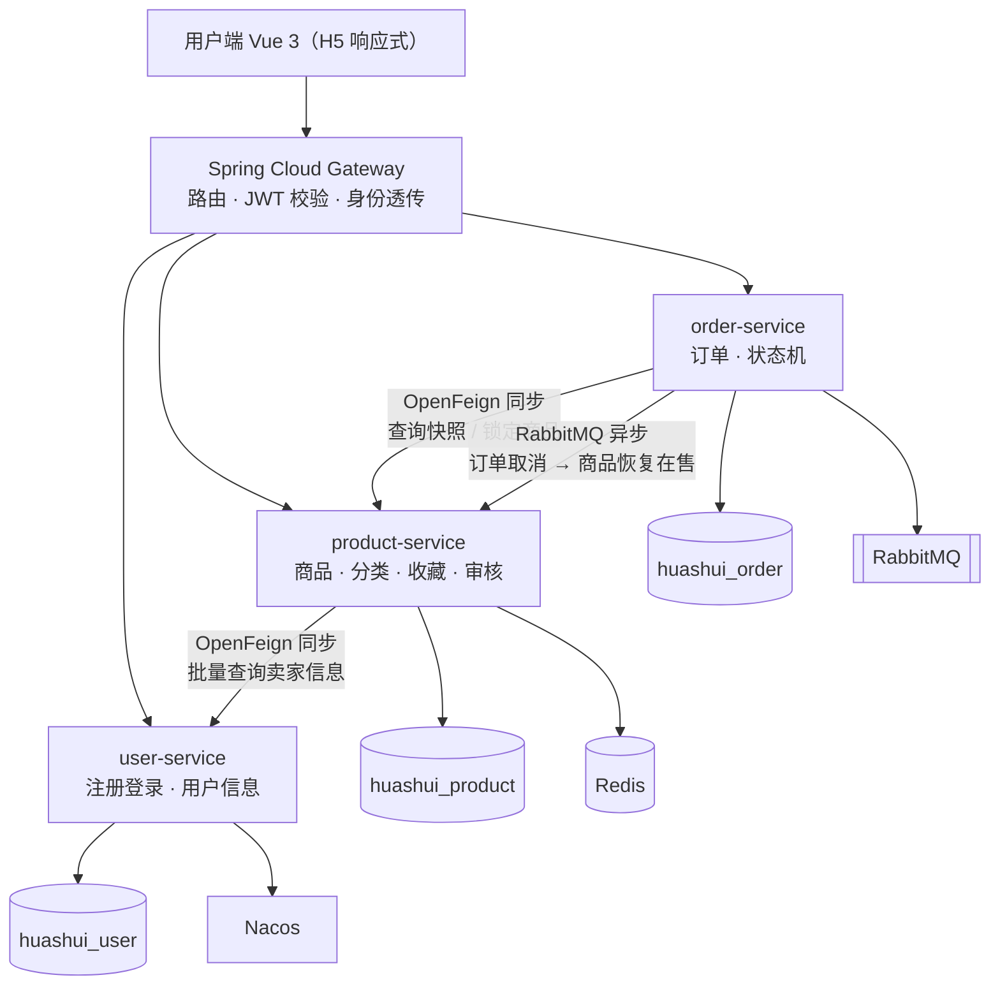

# 华水校园闲置交易平台

> 面向华北水利水电大学学生的校内 C2C 闲置物品交易平台 —— 基于 Spring Cloud Alibaba 微服务架构的实践项目。

[](https://openjdk.org/projects/jdk/17/)
[](https://spring.io/projects/spring-boot)
[](https://spring.io/projects/spring-cloud)
[](#)

---

## 项目简介

校园二手的真实场景是：**同一个学生既是买家也是卖家** —— 今天卖掉旧教材，明天买一副二手耳机。因此本平台不区分买家/卖家角色，一个账号贯通发布与购买。

平台定位为**信息撮合**：只负责商品展示、订单状态记录与交易过程留痕，**不介入资金流**。交易方式为**校内当面自提**，买卖双方线下完成付款。

## 功能概览

| 端 | 功能 |
|---|---|
| 用户端（Vue 3 · H5） | 注册登录、浏览/搜索商品、商品详情、发布商品、收藏、下单、订单管理、上下架 |
| 管理端（预留） | 商品审核、商品管理、用户管理、分类管理 |

## 技术栈

| 分类 | 技术 |
|---|---|
| 语言 / 构建 | Java 17、Maven 3.9 |
| 框架 | Spring Boot 3.2.4、Spring Cloud 2023.0.1、Spring Cloud Alibaba 2023.0.1.0 |
| 注册中心 / 配置中心 | Nacos 2.3.2 |
| 网关 | Spring Cloud Gateway |
| 服务调用 | OpenFeign |
| 数据访问 | MySQL 8.0、MyBatis-Plus |
| 缓存 | Redis |
| 消息队列 | RabbitMQ |
| 任务调度 | XXL-JOB |
| 服务保护 | Sentinel |
| 鉴权 | JWT |
| 接口文档 | Knife4j |
| 前端 | Vue 3 + Vite |
| 部署 | Docker Compose |

## 系统架构



### 架构要点

- **服务拆分为 4 个**，`user / product / order` 是领域上真正正交的边界，不为凑数而拆。
- **3 个独立 database 共用同一 MySQL 实例**，每个服务只连自己的库，从物理上防止跨服务 JOIN。
- **同步调用（OpenFeign）用于用户可感知的关键路径**（下单锁定商品必须立刻知道成败）；**异步消息（RabbitMQ）用于旁路副作用**（取消订单后恢复商品上架允许秒级延迟）。
- **禁止 `product → order` 的反向调用**，避免循环依赖；订单取消后的状态恢复由 order 服务主动推送。

## 核心业务状态机

**商品**：`待审核 → 在售 → 已锁定 → 已售出`，另有 `已下架` / `已驳回`

**订单**：`待支付 → 已付款 → 交易完成`，分支 `已取消`（超时或主动取消）异步恢复商品为在售

## 模块说明

| 模块 | 说明 |
|---|---|
| `huashui-common` | 公共模块（**非可部署服务**）：统一响应体、错误码、全局异常、JWT 工具、状态枚举、用户上下文 |
| `huashui-gateway` | 统一入口：路由、JWT 校验、CORS、身份透传 |
| `huashui-user-service` | 用户域：注册、登录、用户信息、管理员用户管理 |
| `huashui-product-service` | 商品域：商品、分类、图片、收藏、审核、缓存 |
| `huashui-order-service` | 交易域：下单、订单状态流转、超时取消、消息投递 |

## 端口规划

本机同时存在其他项目，为避免端口冲突，本项目统一使用非默认端口（容器内端口保持默认，仅映射到宿主机时改变）。

**应用服务**

| 模块 | 端口 |
|---|---|
| `huashui-gateway` | 6001 |
| `huashui-user-service` | 6002 |
| `huashui-product-service` | 6003 |
| `huashui-order-service` | 6004 |

**基础设施**

| 组件 | 容器内端口 | 宿主机端口 | 方式 |
|---|---|---|---|
| MySQL 8.0 | — | 3306 | 本地安装（不容器化） |
| Redis | 6379 | 16379 | Docker Compose |
| RabbitMQ AMQP | 5672 | 5673 | Docker Compose |
| RabbitMQ 管理台 | 15672 | 15673 | Docker Compose |
| Nacos HTTP | 8848 | 18848 | Docker Compose |
| Nacos gRPC | 9848 / 9849 | 19848 / 19849 | Docker Compose |

> Nacos 客户端的 gRPC 端口按「主端口 + 1000 / +1001」推导，因此 `18848` 对应 `19848` / `19849`。

## 本地启动

**1. 建库建表**

```bash
# 建 3 个 database
mysql -uroot -p < docs/sql/00-create-database.sql

# 建表 + 初始化分类数据（可重复执行，不会清空已有数据）
mysql -uhuashui -p < docs/sql/01-user.sql
mysql -uhuashui -p < docs/sql/02-product.sql
mysql -uhuashui -p < docs/sql/03-order.sql
```

**2. 启动基础设施**

```bash
docker compose -f docker/docker-compose.yml up -d
docker compose -f docker/docker-compose.yml ps
```

| 组件 | 访问地址 | 凭据 |
|---|---|---|
| Nacos 控制台 | http://127.0.0.1:18848/nacos | 本地未开启鉴权 |
| RabbitMQ 管理台 | http://127.0.0.1:15673 | `huashui` / `huashui@123` |

> 容器端口只绑定 `127.0.0.1`，局域网内其他设备无法访问。
> `docker-compose.yml` 中的凭据是**本地开发专用**，生产环境应改为通过环境变量注入。

**3. 敏感配置**

应用侧的数据库密码等**不提交到仓库**，复制模板到本地文件后填写：

```bash
cp huashui-user-service/src/main/resources/application-local.yml.example \
   huashui-user-service/src/main/resources/application-local.yml
```

（该文件在阶段 3 引入 gateway 时创建）

**4. 启动服务**

按顺序启动：`gateway` → `user-service` → `product-service` → `order-service`，在 Nacos 控制台确认注册成功。

## 开发进度

- [x] 总体设计 V1
- [x] 阶段 1：Maven 父工程 + `huashui-common`
- [x] 阶段 2：基础设施 + 建库建表
- [ ] 阶段 3：gateway
- [ ] 阶段 4：user-service
- [ ] 阶段 5：product-service
- [ ] 阶段 6：前端最小闭环
- [ ] 阶段 7：order-service
- [ ] 阶段 8：Redis 缓存体系
- [ ] 阶段 9：RabbitMQ 消息可靠性
- [ ] 阶段 10：XXL-JOB
- [ ] 阶段 11：Sentinel
- [ ] 阶段 12：商品审核 + 管理端
- [ ] 阶段 13：Docker 全量部署 + 文档

详细设计见 [`docs/01-总体设计V1.md`](docs/01-总体设计V1.md)。

## 关于本项目

本项目为个人学习与实践项目，目标是完整走通 Spring Cloud 微服务的技术链路。

开发过程中**使用 AI 工具辅助编码**；需求拆解、技术选型、业务口径定义与代码验收由本人完成。

## License

MIT
