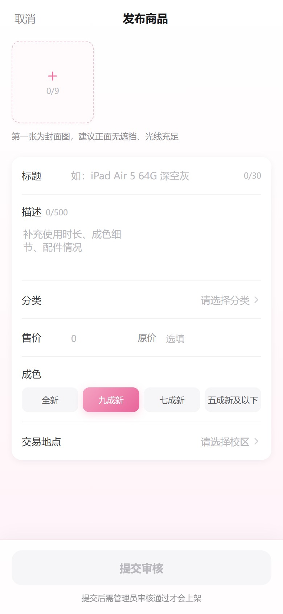
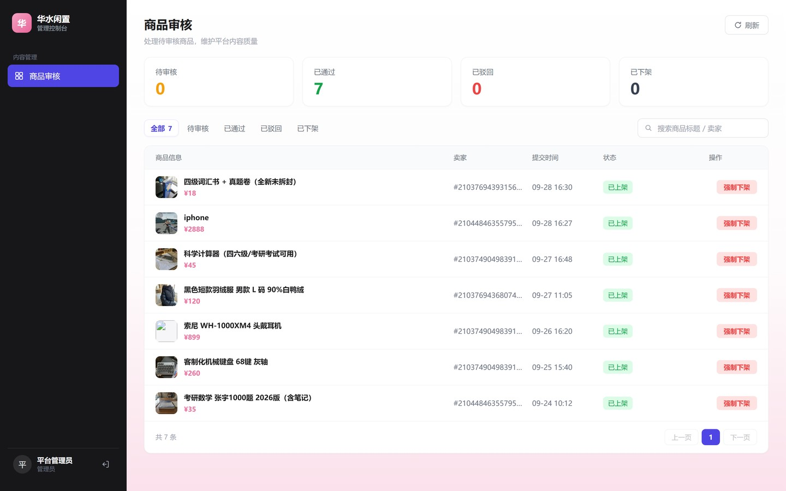
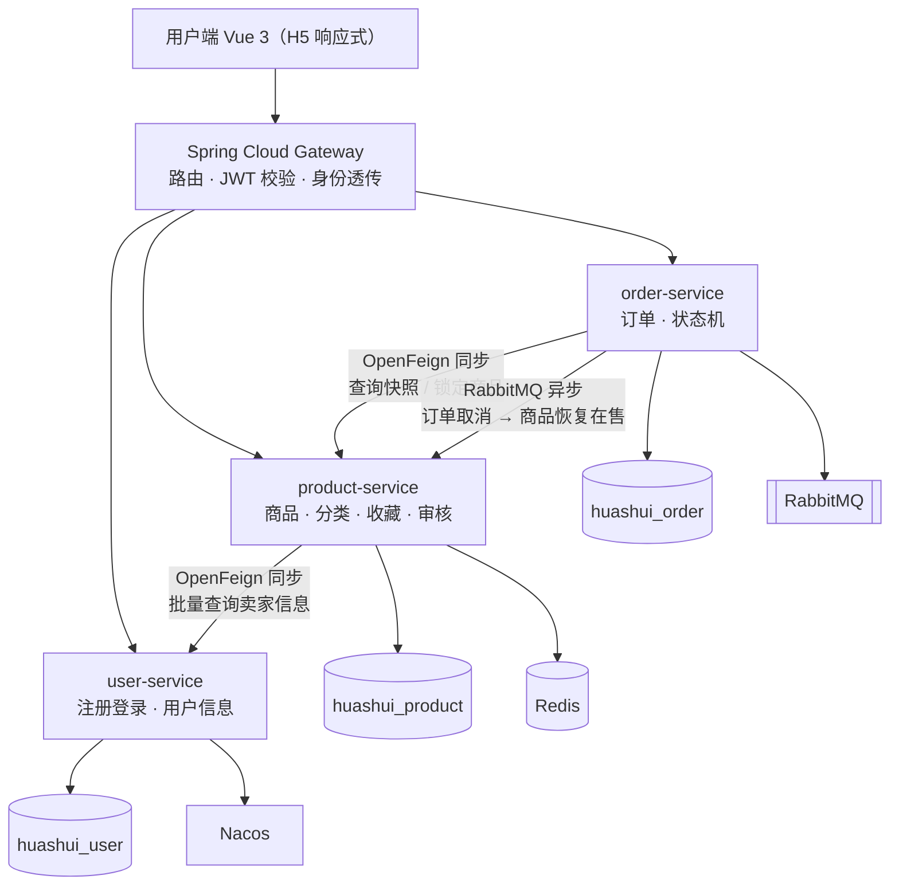

# 华水校园闲置交易平台

> 面向华北水利水电大学学生的校内 C2C 闲置物品交易平台 —— 基于 Spring Cloud Alibaba 微服务架构的实践项目。

[](https://openjdk.org/projects/jdk/17/)
[](https://spring.io/projects/spring-boot)
[](https://spring.io/projects/spring-cloud)
[](#)

---

## 界面预览

**用户端** — Vue 3 + Vite，375 宽移动端优先设计，桌面自动居中限宽

<p align="center">
  
  
  
  
</p>

<p align="center">
  <sub>首页推荐 · 商品详情（校内自提点 + 先联系后下单） · 发布商品 · 订单详情（30 分钟见面付款时间窗）</sub>
</p>

**管理端** — 与用户端同一个工程（`/admin/*` + 独立桌面布局），不是第二套前端

<p align="center">
  
</p>

<p align="center">
  <sub>商品审核：统计卡 · 状态 Tab 带计数 · 标题搜索 · 通过 / 驳回 / 强制下架</sub>
</p>

更多页面见 [页面截图](#页面截图)。

**视觉口径**：单一主色（玫瑰粉）+ 大留白，**价格是页面上唯一的强调色**；
不堆分类图标墙、不做促销话术、不用 emoji——目标是「克制的校园工具感」，
让信息层级自己说话。

## 项目简介

校园二手的真实场景是：**同一个学生既是买家也是卖家** —— 今天卖掉旧教材，明天买一副二手耳机。因此本平台不区分买家/卖家角色，一个账号贯通发布与购买。

平台定位为**信息撮合**：只负责商品展示、订单状态记录与交易过程留痕，**不介入资金流**。交易方式为**校内当面自提**，买卖双方线下完成付款。

## 功能概览

| 端 | 功能 |
|---|---|
| 用户端（Vue 3 · H5） | 注册登录 · 浏览 / 搜索筛选（分类·校区·成色·排序）· 商品详情 · 发布商品（多图上传）· 收藏 · 下单 · 订单管理（倒计时 / 取消 / 确认收货）· 通知中心 · 卖家主页 |
| 管理端（Vue 3 · PC 后台） | 商品审核列表（统计卡 · 状态 Tab · 标题搜索）· 审核通过 · 审核驳回（必填原因）· 强制下架 · 待审核数字徽章 |

## 技术栈

| 分类 | 技术 |
|---|---|
| 语言 / 构建 | Java 17、Maven 3.9 |
| 框架 | Spring Boot 3.2.4、Spring Cloud 2023.0.1、Spring Cloud Alibaba 2023.0.1.0 |
| 注册中心 / 配置中心 | Nacos 2.3.2 |
| 网关 | Spring Cloud Gateway |
| 服务调用 | OpenFeign |
| 数据访问 | MySQL 8.0、MyBatis-Plus |
| 缓存 | Redis |
| 消息队列 | RabbitMQ |
| 任务调度 | XXL-JOB |
| 服务保护 | Sentinel |
| 鉴权 | JWT |
| 接口文档 | Knife4j |
| 前端 | Vue 3 + Vite |
| 部署 | Docker Compose |

## 系统架构



### 架构要点

- **服务拆分为 4 个**，`user / product / order` 是领域上真正正交的边界，不为凑数而拆。
- **3 个独立 database 共用同一 MySQL 实例**，每个服务只连自己的库，从物理上防止跨服务 JOIN。
- **同步调用（OpenFeign）用于用户可感知的关键路径**（下单锁定商品必须立刻知道成败）；**异步消息（RabbitMQ）用于旁路副作用**（取消订单后恢复商品上架允许秒级延迟）。
- **禁止 `product → order` 的反向调用**，避免循环依赖；订单取消后的状态恢复由 order 服务主动推送。

## 核心业务状态机

**商品**：`待审核 → 在售 → 已锁定 → 已售出`，另有 `已下架` / `已驳回`

**订单**：`待支付 → 已付款 → 交易完成`，分支 `已取消`（超时或主动取消）异步恢复商品为在售

## 模块说明

| 模块 | 说明 |
|---|---|
| `huashui-common` | 公共模块（**非可部署服务**）：统一响应体、错误码、全局异常、JWT 工具、状态枚举、用户上下文 |
| `huashui-gateway` | 统一入口：路由、JWT 校验、CORS、身份透传 |
| `huashui-user-service` | 用户域：注册、登录、用户信息、管理员用户管理 |
| `huashui-product-service` | 商品域：商品、分类、图片、收藏、审核、缓存 |
| `huashui-order-service` | 交易域：下单、订单状态流转、超时取消、消息投递 |

## 端口规划

本机同时存在其他项目，为避免端口冲突，本项目统一使用非默认端口（容器内端口保持默认，仅映射到宿主机时改变）。

**应用服务**

| 模块 | 端口 |
|---|---|
| `huashui-gateway` | 6001 |
| `huashui-user-service` | 6002 |
| `huashui-product-service` | 6003 |
| `huashui-order-service` | 6004 |

**基础设施**

| 组件 | 容器内端口 | 宿主机端口 | 方式 |
|---|---|---|---|
| MySQL 8.0 | — | 3306 | 本地安装（不容器化） |
| Redis | 6379 | 16379 | Docker Compose |
| RabbitMQ AMQP | 5672 | 5673 | Docker Compose |
| RabbitMQ 管理台 | 15672 | 15673 | Docker Compose |
| Nacos HTTP | 8848 | 18848 | Docker Compose |
| Nacos gRPC | 9848 / 9849 | 19848 / 19849 | Docker Compose |
| XXL-JOB 调度中心 | 8080 | 18080 | Docker Compose |
| Sentinel 控制台 | 8858 | 18858 | Docker Compose |
| Sentinel 客户端（gateway / user / product / order） | — | 8719 / 8720 / 8721 / 8722 | 内嵌在服务里 |

> Nacos 客户端的 gRPC 端口按「主端口 + 1000 / +1001」推导，因此 `18848` 对应 `19848` / `19849`。

## 本地启动

**1. 建库建表**

```bash
# 建 3 个 database
mysql -uroot -p < docs/sql/00-create-database.sql

# 建表 + 初始化分类数据（可重复执行，不会清空已有数据）
mysql -uhuashui -p < docs/sql/01-user.sql
mysql -uhuashui -p < docs/sql/02-product.sql
mysql -uhuashui -p < docs/sql/03-order.sql
```

表结构变更后可重置重建（⚠️ 会删除数据，仅限开发期）：

```bash
mysql -uhuashui -p < docs/sql/99-reset-tables.sql   # 先删表
mysql -uhuashui -p < docs/sql/01-user.sql           # 再依次重建
mysql -uhuashui -p < docs/sql/02-product.sql
mysql -uhuashui -p < docs/sql/03-order.sql
```

> ⚠️ **脚本必需项**：所有 SQL 脚本顶部都有 `SET NAMES utf8mb4;`。
> 中文 Windows 下 mysql 客户端默认字符集是 `gbk`，而脚本文件是 UTF-8，
> 缺少这一行会把中文写成双重编码的乱码——且这种乱码在同样用 gbk 读取时看起来是正常的，
> 只有 IDEA / Navicat 这类 UTF-8 工具才会暴露。**排查用 `SELECT HEX(列名), LENGTH(列名)`。**

**2. 启动基础设施**

```bash
docker compose -f docker/docker-compose.yml up -d
docker compose -f docker/docker-compose.yml ps
```

| 组件 | 访问地址 | 凭据 |
|---|---|---|
| Nacos 控制台 | http://127.0.0.1:18848/nacos | 本地未开启鉴权 |
| RabbitMQ 管理台 | http://127.0.0.1:15673 | `huashui` / `huashui@123` |
| XXL-JOB 调度中心 | http://127.0.0.1:18080/xxl-job-admin | `admin` / `123456`（首次登录后请改） |
| Sentinel 控制台 | http://127.0.0.1:18858 | `sentinel` / `sentinel` |

> 容器端口只绑定 `127.0.0.1`，局域网内其他设备无法访问。
> `docker-compose.yml` 中的凭据是**本地开发专用**，生产环境应改为通过环境变量注入。

**2.1 建调度中心的库（首次）**

```bash
mysql -uhuashui -p < docs/sql/04-xxl-job.sql       # 官方表结构（库名改为 huashui_job）
mysql -uhuashui -p < docs/sql/05-xxl-job-init.sql  # 执行器组 + 4 个任务定义
```

> `huashui` 账号默认只授权了 3 个业务库，新增 `huashui_job` 时需要先用 root 授权一次：
> `GRANT ALL PRIVILEGES ON huashui_job.* TO 'huashui'@'localhost'; FLUSH PRIVILEGES;`
>
> 任务定义做成脚本而不是在界面里点：别人克隆后导入即可用，且 cron / 阻塞策略这些配置可被 review。

**2.2 导入 Nacos 配置（阶段 12）**

```bash
python docs/nacos/import-configs.py   # 幂等，可重复执行
```

> 业务参数与 Sentinel 规则存 Nacos（group `HUASHUI_GROUP`），改完秒级生效、无需重启。
> **改规则 / 调参数在 Nacos 控制台做**（`http://127.0.0.1:18848/nacos`）；Sentinel 控制台只看监控。
> `configs/` 下的文件必须保持纯 ASCII（Windows 下 SCA 按 JVM 默认编码 GBK 解码 Nacos 内容，
> 中文注释会导致整份配置解析失败并静默回退到代码默认值，详见 `docs/nacos/README.md`）。
> Nacos 没启动时服务照常启动，走代码内置的兜底规则——两套规则同值，只是失去热更新能力。

**3. 敏感配置**

应用侧的数据库密码等**不提交到仓库**，复制模板到本地文件后填写：

```bash
# 三个连数据库的服务各需要一份（gateway 不连库，不需要）
for m in user product order; do
  cp huashui-${m}-service/src/main/resources/application-local.yml.example \
     huashui-${m}-service/src/main/resources/application-local.yml
done
```

（`application-local.yml` 已在 `.gitignore` 中，不会被提交。仓库是公开的，数据库密码一旦提交就等于公开。）

**4. 启动服务**

按顺序启动：`gateway` → `user-service` → `product-service` → `order-service`，在 Nacos 控制台确认注册成功。

> **定时任务**：4 个计划任务（超时订单清理 / 锁定超时扫描 / 本地消息补发 / 浏览量结算）
> 由 XXL-JOB 调度中心触发，执行器内嵌在 product 与 order 服务里（端口 6006 / 6005）。
> 启动服务后，去调度中心「执行器管理」确认两个执行器已自动注册，任务即可按 cron 运行。
>
> ⚠️ **不想启动调度中心时**：把 `huashui.order.timeout-task-enabled` 与
> `huashui.order.local-message-task-enabled` 改回 `true`，由本地 `@Scheduled` 顶上
> （这两个开关就是为此预留的降级通道）。但要注意：**两个开关为 false 且调度中心没起时，
> 超时订单不会有人清理**。

## 服务保护（Sentinel）

保护分两层：**网关限流挡住外部流量**，**服务内熔断隔离故障依赖**。

| 位置 | 保护对象 | 规则 | 被触发时的行为 |
|---|---|---|---|
| 网关 | `POST /api/user/login` | QPS 5 | HTTP 429 + `{"code":429,"message":"操作过于频繁，请稍后再试"}` |
| 网关 | `GET /api/product/detail/{id}` | QPS 50 | 同上 |
| 网关 | `POST /api/order` | QPS 10 | 同上 |
| product-service | 商品详情（按 `productId` 计数） | 单个商品 QPS 20 | `{"code":429,"message":"操作过于频繁，请稍后再试"}` |
| order-service | 对商品服务的全部调用（资源名 `productClient`） | 异常比例 > 50%（10s 窗口、最少 5 次请求） | 熔断 30s，期间下单**快速失败**：`{"code":30006,"message":"商品服务暂时不可用，请稍后重试"}` |

设计上有几点是刻意的：

- **限流按接口而不是按服务**：用 Sentinel 的「API 分组」精确到接口。若按服务名限流，登录接口被限流时会连带把「改密码」「看资料」一起掐掉。
- **熔断共享一个资源名**：order 侧对商品域的 4 个调用（锁定 / 解锁 / 标记售出 / 兜底扫描）共用一个熔断器，因为反映的是「商品服务健不健康」这一件事。
- **降级绝不伪造成功**：下单是线下见面付款的起点，「以为下单成功、到地方发现没有」的代价远大于让用户重试一次。
- **业务失败与故障区分开**：「商品已被别人买走」是正常业务结果，不抛异常、不进熔断统计；只有远程调用失败才计入。
- **规则持久化在 Nacos**（阶段 12）：`docs/nacos/` 里的规则文件进 git、可 review、可回滚，改完秒级生效；代码里各 `SentinelRuleConfig` / `SentinelGatewayConfig` 装载的同值规则是 Nacos 未启动时的兜底。改规则在 Nacos 控制台做，Sentinel 控制台只看监控（官方控制台的推规则是内存态，重启即丢）。

## 开发进度

- [x] 总体设计 V1
- [x] 阶段 1：Maven 父工程 + `huashui-common`
- [x] 阶段 2：基础设施 + 建库建表
- [x] 阶段 3：gateway
- [x] 阶段 4：user-service
- [x] 阶段 5：product-service
- [x] 阶段 6：前端（Vue 3 + Vite，移动端优先；与后端并行推进）
- [x] 阶段 7：order-service
- [x] 阶段 8：收藏 + Redis 缓存体系
- [x] 阶段 9：RabbitMQ 消息可靠性
- [x] 阶段 10：XXL-JOB 分布式任务调度
- [x] 阶段 11：Sentinel 限流 / 熔断降级
- [x] 阶段 12：Nacos 配置中心
- [x] 阶段 13：商品审核 + 管理端（同一工程内的 H5 用户端 + PC 后台）
- [ ] 阶段 14：Docker 全量部署 + 文档

数据库建表与初始化脚本见 [`docs/sql/`](docs/sql/)，可直接执行
（脚本顶部已声明 `SET NAMES utf8mb4`，避免中文 Windows 下导入乱码）。

### 商品审核与管理端（阶段 13）

发布 → 待审核 → 管理员审核 → 在售 的闭环已启用（`audit-required` 默认 true，
Nacos 可热改；管理员强制下架在售商品后，卖家重新上架会再次进入待审核，无法绕过审核）。

管理端**与用户端是同一个工程**（`/admin/*` 路由 + 独立桌面布局，不是第二套前端、也不是独立工程），
只做最小闭环：审核列表（统计卡 / 状态 Tab / 标题搜索）· 通过 · 驳回（必填原因）· 强制下架 ·
侧边栏待审核数字徽章；**不做**分类管理与用户禁用启用——管理是低频单人操作，
不必为它建立额外的权限体系与页面。

后端接口在 `/api/product/admin/**`，服务层 `UserContext.requireAdmin()` 校验管理员角色（`role=2`）；
前端的路由守卫只是体验层拦截，**真正的防线在服务端**。管理员账号由
[`docs/sql/06-admin-user.sql`](docs/sql/06-admin-user.sql) 幂等插入（`admin01`，密码见脚本注释）。

## 页面截图

**浏览与交易**

<p align="center">
  
  
  
  
</p>

<p align="center">
  <sub>首页（热门推荐 / 最新发布） · 搜索筛选（分类·校区·成色·排序） · 商品详情 · 卖家主页</sub>
</p>

**发布与订单**

<p align="center">
  
  
  
  
</p>

<p align="center">
  <sub>发布商品 · 我的发布（状态分组 / 驳回原因 / 重新提交） · 我的订单 · 订单详情</sub>
</p>

**通知中心**

<p align="center">
  
</p>

<p align="center">
  <sub>聚合「我的发布 + 我的订单」的通知流：未读圆点、点开单条即已读、全部已读一键清除</sub>
</p>

**管理端**

<p align="center">
  
</p>

<p align="center">
  <sub>桌面后台：统计卡 · 状态 Tab 带计数 · 标题搜索 · 逐条通过 / 驳回 / 强制下架</sub>
</p>

## 关于本项目

本项目为个人学习与实践项目，目标是完整走通 Spring Cloud 微服务的技术链路：
从服务拆分、服务治理（注册发现 / 配置中心 / 限流熔断）、数据一致性（本地消息表 + 幂等消费），
到前端联调与容器化部署。

**开发方式**：由本人主导需求拆解、技术选型、业务口径定义与验收，**AI 结对完成实现**；
每一处改动经本人 review 与实际联调回归（浏览器 + 真机、多账号角色）后才提交。
本项目不使用脚手架式生成，所有业务口径（状态机、审核开关、交易方式、隐私字段的可见范围等）
都在 `docs/` 的设计文档中先行确定，代码与文档偏离时以文档记录决策。

## License

MIT
